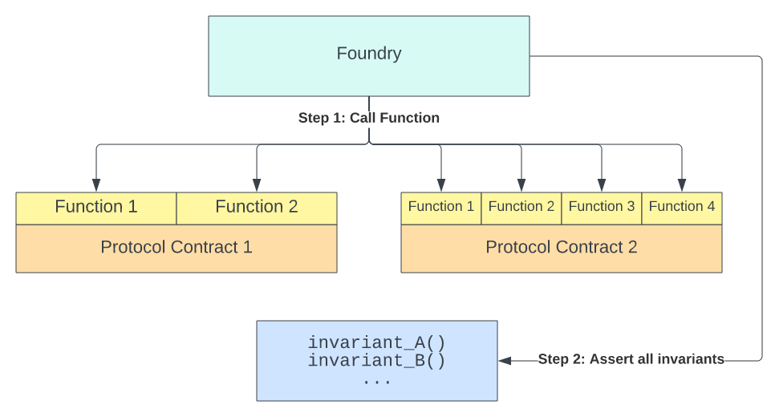

# Foundry Book (Korean Ver.) by 허시원

\*\* 의역이 다소 포함되어 있음. asdfkjahsdlkfhadsf

You can access my GitBook through this URL:

https://dream-academy.gitbook.io/foundry-book-korean-ver.-by/

or this Notion page if you perfer (super slow at initial access):

https://magic-iris-860.notion.site/Foundry-Book-Korean-Ver-by-dc48c3bc94214278906c6a57267b85ab

## Installation

-   프로젝트 생성
    ```solidity
    forge init <project_name>
    ```
-   기존 다른 프로젝트에 생성
    ```solidity
    forge install
    ```

## Dependency Management

-   Dependency 추가 / 제거 / 업데이트
    ```solidity
    forge {install, remove, update} <library_name>
    ```
-   Dependency Remapping

    ```solidity
    forge remappings

    >> forge-std/=lib/forge-std/src
    	 ...
    ```

-   Dependency 커스텀
    -   프로젝트 루트에 remappings.txt 생성
-   Hardhat-style도 지원함
    -   node_modules가 lib, src가 contracts의 역할을 수행
    -   --hh flag로 enable할 수 있음
    -   --hh flag == --lib-paths node_modules --contracts contracts

## Test

### 테스트 코드 작성법

-   Test 대상
    -   “test”로 시작하는 함수가 있으면 모두 test 대상
    -   디렉토리는 상관없음. src폴더에 있어도 test 대상임.
    -   test 디렉토리와 .t.sol은 컨벤션으로서의 역할만 수행
-   특정 테스트만 수행

    ```solidity
    forge test --match-contract <contract_name> --match-test <function_name>

    forge test --match-path <path>
    ```

-   특정 테스트 / path만 제외하는 것도 가능
    > > --no-match-contract / --no-match-test / --no-match-path
-   Trace depth
    -   -v 플래그로 조절
    -   -vv: Log 찍으면 보여줌. assertion error 등도 포함
    -   -vvv: Fail한 테스트에 대한 stack trace
    -   -vvvv: 모든 테스트에 대한 stack trace + fail한 테스트에 대한 setup trace
    -   -vvvvv: 모든 테스트에 대한 stack trace & setup trace
-   Watch mode
    -   파일에 변경사항이 생기면 영향이 미치는 테스트만 다시 돌려줌
    ```solidity
    forge test --watch
    forge test --watch --run-all (rerun all the test)
    ```
-   Forge-std의 Test.sol을 이용함
    -   DSTest의 superset으로, DSTest가 갖는 기능을 모두 포함하고 있음.
        [https://github.com/dapphub/ds-test](https://github.com/dapphub/ds-test)
-   디자인 패턴
    -   test_Revert[ If | When ]\_Condition
        ```solidity
        function test_CannotSubtract43() public {
            vm.expectRevert(stdError.arithmeticError);
            testNumber -= 43;
        }
        ```
    -   상속을 통해 setup을 공유하거나 할 수도 있음

### Forge-std 라이브러리 (Comprehensive)

### Basic

-   vm.sol
    -   cheatcodes interface
-   console.sol
    -   Hardhat style logger
-   script.sol
    -   Supports solidity scripting
-   Test.sol
    -   Standard libraries, including vm.sol and console.sol
-   cheatcode
    ```solidity
    // prank alice and give 100 ether
    hoax(alice, 100 ether);
    ```

### Log

-   DSTest가 지원하는 log를 모두 지원 / log는 event로서 작동함
    ```solidity
    log(string)
    logs(bytes)
    log_(named)_{address, bytes32, int, uint, bytes, string}
    ```
-   DSTest가 지원하지 않는 array 타입에 대한 log 지원
    -   log_array / log_named_array

### Console Logging

-   한번에 4개까지 찍을 수 있음
-   uint, string, bool, address 타입 지원
-   포맷팅 지원
    -   %s: string으로 변환, uint256, int256, bytes는 0x붙어서 hex로 출력
    -   %d, %i: 32바이트 상수에 대해 %s와 동일
    -   %e: 32바이트 상수에 대해 exponential로 표현해줌
    -   %x: 32바이트 상수에 대해 hex로 표현해줌
    -   %o: Object → JS 오브젝트 스타일로 표현해줌. 보통 “” 붙은 string
    -   %%: “%” 써야할때.. 포맷아님

### Assert

-   DSTest가 지원하는 assert를 모두 지원
-   Error 메시지 출력 지원 (argument에 string memory err 추가)

    ```solidity
    // 1. Equal
    assertEq(address, bytes32, int, uint)

    // 2. Equal Decimal
    assertEqDecimal(int, uint)
    assertEqDecimal(int a, int b, uint decimals)

    // 3. Equal 32 bytes
    assertEq32(bytes32)

    // 4. ?
    assertEq0(bytes memory)

    // 5. > / >= / < / <=
    assertGt / assertGe / assertLt / assertLe
    + Decimal
    ```

-   추가 assert
    -   fail
        -   특정 execution point에 도달하면 fail을 발생시킴
    -   assertFalse
    -   assertEq on bool, bytes, int256, uint256
    -   assertEqUint
        -   다른 길이의 int에 대한 비교 지원
        -   e.g. assertEqUint(uint8(1), uint256(1))
    -   assertApproxEqAbs
        -   두 값의 차이가 일정 수준 이하임
    -   assertApproxEqRel
        -   두 값의 비가 일정 퍼센트 이하임
        -   1e18 = 100%

### Cheats

-   Skip
    -   block.timestamp를 N초만큼 skip
        ```solidity
        assertEq(block.timestamp, 0);
        skip(3600);
        assertEq(block.timestamp, 3600);
        ```
-   rewind
    -   block.timestamp를 N초만큼 되돌림
    -   exactly opposite of Skip()
-   hoax
    -   특정 주소를 ETH와 함께 prank함
    -   ETH 수량을 정하지 않으면 2^128 wei(매우 많음)를 지급
        ```solidity
        hoax(address who, address origin, uint256 give)
        ```
        origin은 ETH가 특정 주소로부터 지급될 수 있도록 하는듯
-   startHoax
    -   임시 hoax
    -   startHoax(who, origin, give) 뒤 stopHoax()
-   deal
    -   특정 주소에 ERC-20 토큰을 지급함
    ```solidity
    deal(address(dai), alice, 10000e18);
    assertEq(dai.balanceOf(alice), 10000e18);
    ```
-   deployCode
    -   artifacts 디렉토리에 있는 컨트랙트의 바이트코드를 fetch해 컨트랙트를 배포함
    -   val parameter로 msg.value 패싱 가능함
-   bound

    -   fuzz test 할때 input을 특정 bound로 enum할 수 있음

        ```solidity
        input = bound(input, 99, 101);

        // Returns 99 for input 0.
        // Returns 100 for input 1.
        // Returns 101 for input 2.
        // Returns 99 for input 3.
        ```

-   changePrank
    -   현재 prank된 주소를 끄고 다른 주소를 prank함
-   makeAddr
    -   어떤 이름이 부여된 주소를 생성할 수 있음
    -   주소 생성하면 이름이 그 주소에 대한 label이라는 속성으로 저장됨
        ```solidity
        address alice = makeAddr("alice");
        emit log_address(alice); // 0x328809bc894f92807417d2dad6b7c998c1afdac6
        ```
-   makeAddrAndKey
    -   주소와 개인키 생성
        ```solidity
        (address alice, uint256 key) = makeAddrAndKey("alice");
        emit log_address(alice); // 0x328809bc894f92807417d2dad6b7c998c1afdac6
        emit log_uint(key); // 70564938991660933374592024341600875602376452319261984317470407481576058979585
        ```
-   noGasMetering
    -   modifier
    -   함수 실행동안 gas가 측정되지 않음 → gasleft() 연산에서 제외됨

### Error

-   쓰는 이유: 에러 타입을 지정해서 assert할 수 있음
    ```solidity
    vm.expectRevert(stdError.arithmeticError)
    ```
-   assertionError
    -   assert 실패시 발생
-   arithmeticError
    -   arithmetic over/underflow
-   divisionError
    -   division by zero
-   enumConversionError
    -   상수를 enum으로 변환하려할 때 발생
    -   enum의 variant보다 상수의 값이 더 크면 에러 발생
    -   !예시 필요
-   encodeStorageError
    -   스토리지의 데이터가 corrupt되었을 때 발생
    -   assembly가 사용되지 않았다면 이런 일은 없긴 함
-   popError
    -   빈 배열에서 pop하면 발생
-   index00BError
    -   배열 out of bound 에러
-   memOverflowError
    -   동적 메모리 배열에 2^64-1개 이상의 원소를 넣으면 발생
-   zeroVarError
    -   init 안된 function pointer 호출하면 발생

### Storage

-   스토리지에 query / write 등 다양한 작업 수행 가능
-   packed slot에 접근하는 것은 불가능
-   type를 저장하는 튜블이 32바이트보다 짧으면 slot 조회 안되는 버그 있음
-   스토리지를 조회하기 위해 다음과 같은 descriptor 사용
    -   target
        -   타겟 컨트랙트의 주소 설정
        -   디폴트는 0번으로 설정
    -   sig
        -   함수 호출을 위한 4바이트 selector
    -   with_key
        -   함수 호출을 위한 argument passing
        -   여러개일 경우 여러번 불러야함. 순서 상관 있음.
    -   depth
        -   튜플 내의 position을 설정
        -   디폴트는 0으로 설정
        -   !예시 필요
    -   checked_write
        -   스토리지에 쓰여질 데이터 설정
        -   bool, address, bytes32, uint256
    -   find
        -   target, sig, with_key, depth를 이용해 스토리지 슬롯 번호 조회
    -   read
        -   스토리지 내 값을 읽어옴
        -   bool, address, bytes32, int256, uint256
-   Storage Manipulation

    -   위에서 언급한 descriptor를 사용해 스토리지를 조회하고, 접근해 값을 바꾸는 작업 수행 가능

    ```solidity
    using stdStorage for StdStorage;

    ...

    // `game` 컨트랙트의 `score` 함수 호출
    // and change its value to 10
    stdstore
        .target(address(game))
        .sig(game.score.selector)
        .checked_write(10);
    ```

### Math

-   Solidity에서 지원하지 않는 math 기능 지원
-   지원하는 기능은 abs, delta, percentDelta
    -   abs
        -   절대값 반환
        ```solidity
        uint256 ten = stdMath.abs(-10);
        ```
    -   delta
        -   두 값의 차이 반환
        -   arithmeticError-safe
        ```solidity
        uint256 four = stdMath.delta(-1, 3);
        ```
    -   percentDelta
        -   delta의 퍼센트버전
        -   1e18 = 100%
        ```solidity
        uint256 percent150 = stdMath.percentDelta(uint256(125), 50);
        uint256 percent60 = stdMath.percentDelta(uint256(50), 125);
        ```

### Script

-   computeCreateAddress
    -   배포자 주소와 nonce로 생성될 주소를 계산해줌
    -   컨트랙트가 배포될 주소를 미리 알 수 있음
-   deriveRememberKey

    -   니모닉으로부터 private key를 불러와 forge의 local wallet에 저장함
    -   주소와 private key를 반환함
    -   니모닉은 BIP39 지정 단어만 지원

    ```solidity
    string memory mnemonic = "test test test test test test test test test test test junk";

    (address deployer, uint256 privateKey) = deriveRememberKey(mnemonic, 0);

    bytes32 hash = keccak256("Signed by deployer");
    (uint8 v, bytes32 r, bytes32 s) = vm.sign(privateKey, hash);

    vm.startBroadcast(deployer);
    ...
    vm.stopBroadcast();
    ```

### Fork Testing

-   특정 환경을 포크해서 테스트해볼 수 있음
-   두가지 접근법이 있음
    -   forge test —fork-url을 사용한 싱글 포크
    -   forking cheatcode를 사용한 멀티 포크

### 싱글 포크

-   포크해오면 포크한 환경에 맞게 다음 변수들의 값이 바뀜
    -   block_number
    -   chain_id
    -   gas_limit
    -   gas_price
    -   block_base_fee_per_gas
    -   block_coinbase
    -   block_timestamp
    -   block_difficulty
    -   블록과 가스에 대한 값은 다 바뀐다고 보면 됨. 시점이 바뀌니까
-   포크해올 블록을 지정할 수 있음
    ```solidity
    forge test --fork-url <your_rpc_url> --fork-block-number 1
    ```
-   이더스캔 API key 들고오면 보다 정확한 정보 받아올 수 있음
    ```solidity
    forge test --fork-url <your_rpc_url> --etherscan-api-key <your_etherscan_api_key>
    ```
-   --fork-url과 --fork-block-number가 둘다 지정되면 해당 블록 데이터는 추후 테스트에 캐시됨
    -   저장 위치: ~/.foundry/cache/rpc/<chain_name>/<block_number>
    -   forge clean으로 캐시 지울 수 있음. 근데 빌드한 artifact도 같이 날아감
    -   캐시 필요 없을 때: 커맨드에 --no-storage-caching 플래그 넣거나 foundry.toml에 no_storage_caching / rpc_storage_caching 넣으면 캐시 무시함

### 멀티 포크

-   왜 쓰나?
    -   테스트별로 포크 다르게 해올 수 있음. 좋네
    -   각 포크는 uint256 identifier로 매핑됨
-   setUp에서 포크 여러개해두고 identifier로 갖다 쓰는 방법도 사용 가능
-   관련 메서드
    -   createFork / selectFork / createSelectFork
        -   포크 생성 / 선택 / 생성+선택
    -   activeFork
        -   현재 설정된 포크 출력
    -   rollFork
        -   현재 포크의 블록넘버 설정 가능
    -   makePersistent
        -   특정 계정을 테스터와 같이 persistent하게 만들어줌
        -   반대로 revokePersistent(address)도 지원
    -   isPersistent
        -   특정 주소가 persistent인지 출력
    -   allowCheatcodes
        -   특정 주소에 대해 cheatcode의 사용을 허가함
        -   디폴트로 테스트 컨트랙트와 배포자가 cheatcode 사용이 허가되어있음
        -   cheatcode 권한이 있는 주소에 컨트랙트 배포시 cheatcode 권한은 자동 부여
        -   복잡한 setup이 설정된 경우에 대해서 유용할 수 있음
        -   ! 예시 및 추가설명 필요
    -   transact
        -   트랜잭션 해시를 이용해 트랜잭션을 끌어와서 현 state에서 내가 실행할 수 있음
        -   신기함
-   각 포크는 독립적인 EVM으로서 동작함
    -   스토리지도 따로임
    -   하지만 msg.sender와 persistent account의 상태, test contract의 state는 공유함

### Cast와 Anvil을 이용한 Mainnet Fork Example

-   Cast와 Anvil을 사용하면 실제 네트워크를 포크해서 테스트할 수 있다.
-   Dai 토큰을 Anvil에서 만든 계정으로 보내는 튜토리얼을 해보자.

    -   메인넷 포크해오기
        ```jsx
        $ anvil --fork-url https://mainnet.infura.io/v3/$INFURA_KEY
        ```
        -   10개의 계정 주소와 private key를 생성해줌
    -   이더스캔에 가서 Dai 토큰 홀더를 아무나 찾아보기 (LUCKY_USER)
        -   unlucky 아님?
    -   환경변수 설정
        ```jsx
        $ export ALICE=0xf39fd6e51aad88f6f4ce6ab8827279cfffb92266
        $ export DAI=0x6b175474e89094c44da98b954eedeac495271d0f
        $ export LUCKY_USER=0xad0135af20fa82e106607257143d0060a7eb5cbf
        ```
    -   cast 로 내 balance 확인
        ```jsx
        $ cast call $DAI \
          "balanceOf(address)(uint256)" \
          $ALICE
        >> 0
        ```
    -   cast로 lucky_user balance 확인
        ```jsx
        $ cast call $DAI \
          "balanceOf(address)(uint256)" \
          $LUCKY_USER
        >> 71686045944718512103110072
        ```
    -   cast send로 lucky user의 DAI를 나한테 보냄
        ```jsx
        # This calls Anvil and lets us impersonate our lucky user
        $ cast rpc anvil_impersonateAccount $LUCKY_USER
        $ cast send $DAI \
        --from $LUCKY_USER \
          "transfer(address,uint256)(bool)" \
          $ALICE \
          1686045944718512103110072
        blockHash               0xbf31c45f6935a0714bb4f709b5e3850ab0cc2f8bffe895fefb653d154e0aa062
        blockNumber             15052891
        ...
        ```
    -   토큰 보내진걸 확인 가능

        ```jsx
        cast call $DAI \
          "balanceOf(address)(uint256)" \
          $ALICE
        1686045944718512103110072

        $ cast call $DAI \
          "balanceOf(address)(uint256)" \
          $LUCKY_USER
        70000000000000000000000000
        ```

        -   어찌됐건 테스트환경에서만 일어난 일이다.

### Advanced - Fuzz

-   Property-based 테스트에 대한 지원
-   Parametric testing은 지원하지 않고 Fuzzing만 가능하다.
-   고정값이 아닌 변수에 대한 테스트가 가능하다는 장점이 있다.
-   예시
    -   고정값을 사용한 테스트. 1 ether가 잘 전해지는지 테스트한다.
    ```solidity
    function test_Withdraw() public {
      payable(address(safe)).transfer(1 ether);
      uint256 preBalance = address(this).balance;
      safe.withdraw();
      uint256 postBalance = address(this).balance;
      assertEq(preBalance + 1 ether, postBalance);
    }
    ```
    -   property-based 테스트. 모든 amount에 대한 테스트를 통과해야한다.
    ```solidity
    function testFuzz_Withdraw(uint256 amount) public {
      payable(address(safe)).transfer(amount);
      uint256 preBalance = address(this).balance;
      safe.withdraw();
      uint256 postBalance = address(this).balance;
      assertEq(preBalance + amount, postBalance);
    }
    ```
    -   실제로 위 테스트는 2^96-1 wei 이상에서 통과하지 못한다.
    -   uint96을 사용하거나 assume을 사용해 amount의 바운더리를 지정 가능
    ```solidity
    function testFuzz_Withdraw(uint96 amount) public {
        vm.assume(amount > 0.1 ether);
        // snip
    }
    ```
-   FOUNDRY_FUZZ_RUNS 설정을 통해 퍼징 시나리오 개수 조절 가능
-   “mu” → 퍼징동안 사용된 가스 평균
-   “~” → 퍼징동안 사용된 가스 중간값

### Advanced - Invariant

-   왜 쓰나?
    -   지정된 function call을 랜덤한 순서로 실행함
    -   지켜져야만 하는 조건들이 복잡한 동작동안 잘 지켜지는지 테스트할 수 있음
    -   로직 버그를 찾는데 유용함
    -   invariant로 지정된 변수가 함수 호출때마다 assert됨
-   runs 와 depth로 dimension 설정
    -   runs: function call sequence가 생성되는 횟수
    -   depth: 한 run에 대해 수행하는 function call의 횟수
        -   revert 해도 카운트함
-   최대한 많은 Invariant를 설정하는 것이 좋은 invariant testing suite라고 할 수 있음
-   Invariant 설정 방법에는 여러가지가 있음
    -   Direct assertion
        -   컨트랙트를 쿼리해 값을 직접 비교한다.
            ```solidity
            assertGe(token.totalAssets(), token.totalSupply())
            ```
    -   Ghost variable assertion
        -   컨트랙트를 쿼리해 값을 불러오고 test 환경에서 설정한 값과 맞는지 비교한다.
            ```solidity
            assertEq(token.totalSupply(), sumBalanceOf)
            ```
    -   Deoptimizing (Naive Implementation Assertions)
        -   컨트랙트를 쿼리해서 값을 불러온다.
        -   매우 가스 비효율적인 로직으로 가져온 값과 비교한다.
        ```solidity
        assertEq(pool.outstandingInterest(), test.naiveInterest())
        ```
-   Conditional Invariant

    -   invariant가 반드시 true여야만 할 필요는 없다.
    -   특정 컨디션에 따라 제거되거나 변해야만 하는 variable 또한 있기 때문 (예: 청산)
    -   하지만 invariant assertion에 조건문을 넣는 것은 바람직하지 않다.

        -   테스트 코드를 잘못 짜면 false positive가 발생할 수도 있기 때문이다.

        ```solidity
        function invariant_example() external {
          if (protocolCondition) return;

          assertEq(val1, val2);
        }
        ```

        -   위 코드는 특정 조건에 따라 아예 assert가 안될 수 있다.
        -   차라리 조건문 넣을거면 로직마다 assert를 넣어주는 것이 좋다.

        ```solidity
        function invariant_example() external {
            if (protocolCondition) {
                assertLe(val1, val2);
                return;
            };
            assertEq(val1, val2);
        }
        ```

    -   setUp을 통해 여러 환경을 설정해두고 시나리오마다 invariant testing contract를 짜는 방법도 있긴 하다.
        -   하지만 invariant target으로 하여금 fuzzer가 특정 결과만을 뱉도록 유도하는 편이 훨씬 더 powerful한 테스트가 될 것이다.

-   Invariant Target

    -   Target은 contract / sender / selector / artifacts(ABI) / artifact selector 등으로 찾음
    -   Function call probability distribution

        -   타겟 컨트랙트의 함수들은 랜덤으로 호출됨
        -   컨트랙트 단위 / 함수 단위로 확률 분배됨

        ```solidity
        targetContract1: 50%
        ├─ function1: 50% (25%)
        └─ function2: 50% (25%)

        targetContract2: 50%
        ├─ function1: 25% (12.5%)
        ├─ function2: 25% (12.5%)
        ├─ function3: 25% (12.5%)
        └─ function4: 25% (12.5%)
        ```

    -   따라서 함수 적은 컨트랙트는 각 함수가 더 자주 호출될 것임에 유의해야함
    -   컨트랙트 간 함수 개수의 편차가 큰 경우 함수가 많은 컨트랙트는 적게 테스트될 수 있음

-   Helper functions
    -   Forge-std에 포함되어 있음
    ```solidity
    excludeContract(address)
    excludeSender(address)
    excludeArtifact(string memory)
    targetArtifact(string memory)
    targetArtifactSelector(FuzzSelector memory)
    targetContract(address)
    targetSelector(FuzzSelector memory)
    targetSender(address)
    ```
    -   targetContract에 수작업으로 대상 컨트랙트 넣어줘야함
    -   setUp 함수로 배포된 컨트랙트는 자동으로 대상 컨트랙트로 지정됨
        -   주의) 수작업으로 지정된 컨트랙트 없어야됨
    -   대상에서 제외하고 싶으면 excludeContract로 빼줘야함
-   Handler Function
    -   초기조건 없이는 무조건 revert나는 함수들이 있음
        -   deposit, transfer 등
    -   하지만 컨트랙트 자체의 기능에 문제가 있는 것은 아님
    -   실행에 필요한 조건들을 Handler 컨트랙트에 넣어서 올바른 동작을 유도해야함
    -   foundry가 제공하는 그림을 보면서 이해해보자.
        
        
    -   초기조건이 필요한 함수에 대한 호출을 모두 handler 컨트랙트로 프록시해서 호출할 수 있도록 만들어주면 에러 없이 실행할 수 있다.
    -   Ghost variable에 대한 테스트도 가능 (사전에 지정된 상수와 match하는지)
-   Bounded / Unbounded Function
    -   퍼징을 수행할 때 input으로 넣을 값에 대한 bound를 설정할 수 있다.
    -   assume과 같은 기능을 하지만 성능이 좀 더 좋다나
-   Actor Management

    -   prank할 주소를 배열로 만들어두고 여러 주소에 대한 반복적인 테스트를 수행할 수 있다.

    ```solidity
    address[] public actors;

    address internal currentActor;

    modifier useActor(uint256 actorIndexSeed) {
        currentActor = actors[bound(actorIndexSeed, 0, actors.length - 1)];
        vm.startPrank(currentActor);
        _;
        vm.stopPrank();
    }

    // Unbounded
    function deposit(
        uint256 assets,
        uint256 actorIndexSeed
    ) public virtual useActor(actorIndexSeed) {
        asset.mint(currentActor, assets);

        asset.approve(address(token), assets);

        uint256 beforeBalance = asset.balanceOf(address(this));

        uint256 shares = token.deposit(assets, address(this));

        assertEq(asset.balanceOf(address(this)), beforeBalance - assets);

        sumBalanceOf += shares;

        sumDeposits[currentActor] += assets
    }

    // Bounded
    function deposit(uint256 assets, uint256 actorIndexSeed) external {
        assets = bound(assets, 0, 1e30);

        super.deposit(assets, actorIndexSeed);
    }
    ```

### Advanced - Differential

-   왜 쓰나?
    -   같은 함수에 대한 여러가지 implementation을 두고 이들의 output을 비교할 때 사용한다.
    -   둘의 output이 다르면 둘 중 하나는 잘못 구현되어 있음을 알 수 있다.
    -   원래는 differential testing이라고 하는데, forge는 differential testing을 이용한 fuzzing 또한 지원한다. 좋네
-   ffi cheatcode를 사용하면 non-EVM 환경에 대한 테스트도 수행할 수 있다.
-   ffi 치트코드는 쉘 커맨드를 실행하고 결과값을 가져오는 기능을 수행한다.

    ```solidity
    import "forge-std/Test.sol";

    contract TestContract is Test {

        function testMyFFI () public {
            string[] memory cmds = new string[](2);
            cmds[0] = "cat";
            cmds[1] = "address.txt"; // assume contains abi-encoded address.
            bytes memory result = vm.ffi(cmds);
            address loadedAddress = abi.decode(result, (address));
            // Do something with the address
            // ...
        }
    }
    ```

-   퍼징이 언제나 옳은 것은 아니다. 엣지케이스도 존재하므로 유의할 것.
    -   2의 제곱수에 가까운 길이를 가진 배열에 대해 log2ceil 함수가 제대로 작동하지 않는 케이스
        [murky/DifferentialTests.t.sol at main · dmfxyz/murky](https://github.com/dmfxyz/murky/blob/main/differential_testing/test/DifferentialTests.t.sol#L21)
-   ffi 커맨드로 잘 알려진 테스트케이스를 들고와서 벤치마킹하는 데에 쓸 수도 있다. 유용

    -   가스 스냅샷 찍는데 사용할 수도 있다.

    ```solidity
    bytes32[100] data;
    uint256[8] leaves = [4, 8, 15, 16, 23, 42, 69, 88];

    function setUp() public {
        string[] memory inputs = new string[](2);
        inputs[0] = "cat";
        inputs[1] = "src/test/standard_data/StandardInput.txt";
        bytes memory result =  vm.ffi(inputs);
        data = abi.decode(result, (bytes32[100]));
        m = new Merkle();
    }

    function testMerkleGenerateProofStandard() public view {
        bytes32[] memory _data = _getData();
        for (uint i = 0; i < leaves.length; ++i) {
            m.getProof(_data, leaves[i]);
        }
    }
    ```

-   Differential Testing이 더 궁금하다면 패러다임의 GDA를 보면서 갖고 놀아보자.
    [Gradual Dutch Auctions - Paradigm](https://www.paradigm.xyz/2022/04/gda)
-   솔리디티 퍼징 템플릿도 있다.
    [https://github.com/patrickd-/solidity-fuzzing-boilerplate](https://github.com/patrickd-/solidity-fuzzing-boilerplate)

## Deploy

-   한번에 한 컨트랙트만 배포 가능
    ```solidity
    $ forge create --rpc-url <your_rpc_url> \
        --constructor-args "ForgeUSD" "FUSD" 18 1000000000000000000000 \
        --private-key <your_private_key> \
        --etherscan-api-key <your_etherscan_api_key> \
        --verify \
        src/MyToken.sol:MyToken
    ```

## Verify

-   forge create로 배포한 컨트랙트에 대해 자동으로 verify 가능
-   이더스캔 API 키 설정 필수

    ```solidity
    forge verify-contract \
        --chain-id 42 \
        --num-of-optimizations 1000000 \
        --watch \
        --constructor-args $(cast abi-encode "constructor(string,string,uint256,uint256)" "ForgeUSD" "FUSD" 18 1000000000000000000000) \
        --etherscan-api-key <your_etherscan_api_key> \
        --compiler-version v0.8.10+commit.fc410830 \
        <the_contract_address> \
        src/MyToken.sol:MyToken

    Submitted contract for verification:
      Response: `OK`
      GUID: `a6yrbjp5prvakia6bqp5qdacczyfhkyi5j1r6qbds1js41ak1a`
      url: https://kovan.etherscan.io//address/0x6a54…3a4c#code
    ```

-   verification result 폴링해서 바로 가져오려면 --watch 플래그 사용해야함. 플래그 없으면 그냥 verify 여부만 알려줌.
-   위의 예시에서는 ABI encode를 위해 cast를 사용했는데, 이러면 좀 더 편함
-   verify 이후 발생 가능한 에러
    -   Invalid character ‘x’ at position 1
        -   비밀키가 0x로 시작 안함
    -   EIP-1559 not activated
        -   RPC 노드에서 EIP-1559 지원 안함. --legacy 플래그 주면 EIP-1559아닌 레거시 트랜잭션 날려줌.
        -   로컬 개발환경이면 가나슈 대신 하드햇 쓰렴
    -   Failed to parse tokens
        -   인자 타입 확인하렴
    -   signature error
        -   비밀키 맞는지 확인하렴
    -   compiler version commit for verify
        -   컴파일러 버전 확인해보렴
            ```solidity
            ~/.svm/0.x.y/solc-0.x.y --version
            ```
-   관련 버그
    -   이더스캔과의 호환 문제(1)
        -   Forge는 src/lib/test 등 디렉토리 단위로 소스를 가져옴.
        -   그런데 이더스캔은 이런 식으로 소스 recompile 지원 안함.
        -   상대주소로 변경해서 컴파일하면 지원하니까 이렇게 하는걸 권장
    -   이더스캔과의 호환 문제(2)
        -   바이트코드 해시 없는 컨트랙트는 verify 지원 안함

## Gas Tracking

-   Gas Report, Gas Snapshot 두가지 기능 제공
-   개념 정리
    -   Gas Report
        -   Forge가 연산한 함수 단위의 gas 소모치
        -   느리지만 더 자세한 insight 제공
    -   Gas Snapshot
        -   각 테스트가 소모한 gas
        -   빌트인 툴이 더 많음. report만큼 자세하진 않지만 빠름
-   Gas Report

    -   foundry.toml에 대상 컨트랙트를 지정하면 테스트시 가스 소모치를 출력해줌

    ```solidity
    // foundry.toml
    gas_reports = ["MyContract", "MyContractFactory"]

    // shell
    forge test --match-test testBurn --gas-report
    ```

    

    -   foundry.toml에 gas_reports_ignore로 넣으면 무시할 컨트랙트도 설정 가능

-   Gas Snapshot

    -   test function에 대한 gas fee를 출력해줌.
    -   optimization 이후 가스 소모치를 비교하거나 배포 전 가스소모치를 예측하는 데 유용함.

    ```solidity
    $ forge snapshot
    $ cat .gas-snapshot

    ERC20Test:testApprove() (gas: 31162)
    ERC20Test:testBurn() (gas: 59875)
    ERC20Test:testFailTransferFromInsufficientAllowance() (gas: 81034)
    ERC20Test:testFailTransferFromInsufficientBalance() (gas: 81662)
    ERC20Test:testFailTransferInsufficientBalance() (gas: 52882)
    ERC20Test:testInfiniteApproveTransferFrom() (gas: 90167)
    ERC20Test:testMetadata() (gas: 14606)
    ERC20Test:testMint() (gas: 53830)
    ERC20Test:testTransfer() (gas: 60473)
    ERC20Test:testTransferFrom() (gas: 84152)
    ```

    -   결과값을 파일로 저장하고 싶으면 forge snapshot --snap <file_name>
    -   결과값 필터링 기능
        -   --asc / --desc: 오름차순, 내림차순 출력
        -   --min / --max <value>: 특정 값 이상 / 이하의 결과만 출력
    -   결과값 비교 기능

        -   --diff로 저장해둔 스냅샷과 가스 소모치 비교 가능

            ```solidity
            $ forge snapshot --diff .gas-snapshot2

            Running 10 tests for src/test/ERC20.t.sol:ERC20Test
            [PASS] testApprove() (gas: 31162)
            [PASS] testBurn() (gas: 59875)
            [PASS] testFailTransferFromInsufficientAllowance() (gas: 81034)
            [PASS] testFailTransferFromInsufficientBalance() (gas: 81662)
            [PASS] testFailTransferInsufficientBalance() (gas: 52882)
            [PASS] testInfiniteApproveTransferFrom() (gas: 90167)
            [PASS] testMetadata() (gas: 14606)
            [PASS] testMint() (gas: 53830)
            [PASS] testTransfer() (gas: 60473)
            [PASS] testTransferFrom() (gas: 84152)
            Test result: ok. 10 passed; 0 failed; finished in 2.86ms
            testBurn() (gas: 0 (0.000%))
            testFailTransferFromInsufficientAllowance() (gas: 0 (0.000%))
            testFailTransferFromInsufficientBalance() (gas: 0 (0.000%))
            testFailTransferInsufficientBalance() (gas: 0 (0.000%))
            testInfiniteApproveTransferFrom() (gas: 0 (0.000%))
            testMetadata() (gas: 0 (0.000%))
            testMint() (gas: 0 (0.000%))
            testTransfer() (gas: 0 (0.000%))
            testTransferFrom() (gas: 0 (0.000%))
            testApprove() (gas: -8 (-0.000%))
            Overall gas change: -8 (-0.000%)
            ```

        -   --check로 갖고 있는 스냅샷과 비교해 다른 값만 출력할 수도 있음

            ```solidity
            $ forge snapshot --check .gas-snapshot2

            Running 10 tests for src/test/ERC20.t.sol:ERC20Test
            [PASS] testApprove() (gas: 31162)
            [PASS] testBurn() (gas: 59875)
            [PASS] testFailTransferFromInsufficientAllowance() (gas: 81034)
            [PASS] testFailTransferFromInsufficientBalance() (gas: 81662)
            [PASS] testFailTransferInsufficientBalance() (gas: 52882)
            [PASS] testInfiniteApproveTransferFrom() (gas: 90167)
            [PASS] testMetadata() (gas: 14606)
            [PASS] testMint() (gas: 53830)
            [PASS] testTransfer() (gas: 60473)
            [PASS] testTransferFrom() (gas: 84152)
            Test result: ok. 10 passed; 0 failed; finished in 2.47ms
            Diff in "ERC20Test::testApprove()": consumed "(gas: 31162)" gas, expected "(gas: 31170)" gas
            ```

## Debugger

-   자체 디버거를 제공함. 왜 몰랐지
-   forge debug를 통해 사용 가능
    ```solidity
    $ forge test --debug $FUNC
    $ forge debug --debug $FILE --sig $FUNC
    // example
    $ forge debug --debug src/SomeContract.sol --sig "myFunc(uint256,string)" 123 "hello"
    ```
-   Fuzzing test에 대한 디버깅도 지원한다.
    -   Fail 뜨는 경우 첫번째 fail 시나리오를 출력
    -   모두 통과하는 경우 마지막에 통과한 시나리오를 출력
-   디버거는 사분면으로 나뉘어 정보를 출력
    
    -   1번: opcode 출력, 현재 opcode가 하이라이트 처리
    -   2번: 현재 스택과 스택 사이즈 출력
    -   3번: 소스코드
    -   4번: EVM 메모리 상태 출력
    -   스택이나 메모리에 가끔 색깔이 칠해질 때가 있는데,
        -   빨강색: 현재 opcode로 값이 쓰여질 예정
        -   초록색: 직전 opcode로 값이 쓰여짐
        -   파랑색: 메모리의 경우 현재 opcode로 값이 읽힘 / 스택의 경우 읽히거나 pop당함
-   디버거 navigating 단축키
    -   vim이랑 비스무리
    -   General
        -   q: 끄기
    -   OPCODE view
        -   숫자 + k: N개 라인 위로 이동
        -   숫자 + j: N개 라인 아래로 이동
        -   g: 트랜잭션 시작으로 이동
        -   G: 트랜잭션 끝으로 이동
        -   c: 직전 call-type instruction으로 이동 (call, staticcall, delegatecall, callcode 등)
        -   C: 다음 call-type instruction으로 이동
        -   a: 직전 JUMP/JUMPI instruction으로 이동
        -   s: 다음 JUMPDEST instruction으로 이동
    -   Memory view
        -   cmd + k: 위로 스크롤
        -   cmd + j: 아래로 스크롤
        -   m: 메모리를 UTF-8 인코딩해서 보여줌
    -   Stack view
        -   K: 위로 스크롤
        -   J: 아래로 스크롤
        -   t: 스택 라벨 보여줌. 현재 opcode가 건드릴 아이템 확인용으로 사용

## Cheatcode (Comprehensive)

-   왜 쓰나?
    -   Powerful assertion 제공
-   지정된 cheatcode address를 통해 제공
    -   `0x7109709ECfa91a80626fF3989D68f67F5b1DD12D`
    -   좀 규모가 큰 퍼징을 할때는 주소 겹칠수도 있으니까 vm.assume(address ≠ ~~)로 제한해주는 것도 좋을 것
-   Forge-std와 겹치는 기능도 일부 있을 수 있음

### Environment 관련

-   block 관련
    -   warp : block.timestamp 설정
    -   roll : block.number 설정
    -   fee: block.basefee 설정
    -   difficulty: block.difficulty 설정
    -   chainId: block.chainid 설정
    -   coinbase: block.coinbase 설정
-   account 관련

    -   store(account, slot, value): account의 slot에 value를 저장함
    -   load(account, slot): account의 slot에 들어가있는 값을 불러옴

        ```solidity
        /// contract LeetContract {
        ///     uint256 private leet = 1337; // slot 0
        /// }

        vm.store(address(leetContract), bytes32(uint256(0)), bytes32(uint256(31337)));
        bytes32 leet = vm.load(address(leetContract), bytes32(uint256(0)));
        emit log_uint(uint256(leet)); // 31337
        ```

    -   etch(who, code): code가 배포될 주소를 지정할 수 있음
        ```solidity
        bytes memory code = address(awesomeContract).code;
        address targetAddr = address(1);
        vm.etch(targetAddr, code);
        log_bytes(address(targetAddr).code); // 0x60806040523480156...
        ```
    -   deal: ETH나 ERC20을 배당
    -   prank / startPrank / stopPrank: msg.sender 설정
    -   setNonce / getNonce: 트랜잭션을 위한 nonce 설정

-   record 관련

    -   record / accesses

        -   record: 모든 storage read/write를 기록하도록 함
        -   기록된 정보는 accesses를 통해 접근 가능
        -   write는 additional read로 count된다.

            ```solidity
            /// contract NumsContract {
            ///     uint256 public num1 = 100; // slot 0
            ///     uint256 public num2 = 200; // slot 1
            /// }

            vm.record();
            numsContract.num2();
            (bytes32[] memory reads, bytes32[] memory writes) = vm.accesses(
              address(numsContract)
            );
            emit log_uint(uint256(reads[0])); // 1
            ```

        -   만약 reads[1]에 접근한다면 num2를 선언할때 1번 쓰고 1번 읽었으니 2를 출력할 것.
        -   왜 write횟수를 read에 더하는걸까? 불편할듯

    -   recordLogs / getRecordedLogs

        -   emit이 발생한 모든 이벤트를 기록하고 불러옴

            ```solidity
            /// event LogCompleted(
            ///   uint256 indexed topic1,
            ///   bytes data
            /// );

            vm.recordLogs();

            emit LogCompleted(10, "operation completed");

            Vm.Log[] memory entries = vm.getRecordedLogs();

            assertEq(entries.length, 1);
            assertEq(entries[0].topics[0], keccak256("LogCompleted(uint256,bytes)"));
            assertEq(entries[0].topics[1], bytes32(uint256(10)));
            assertEq(abi.decode(entries[0].data, (string)), "operation completed");
            ```

-   mockCall
    -   mock: 흉내 / mockingbird: 앵무새
    -   mockCall(where, value, data, retdata)
    -   where로 향하는 call을 따라함
        -   calldata가 data와 어느정도 매치해야되고, retdata를 반환하는 call에 대해서만
        -   msg.value가 있는 경우 value 인자 사용
    -   우선순위
        -   calldata와 data 일치 여부
        -   calldata와 data의 유사성 여부 (첫 바이트부터 순차적으로 확인)
        -   유사성이 발견되면 call을 날리고 반환값을 retdata에 저장
        -   msg.value가 필요하면 calldata 확인 이후 후순위 확인
    -   알려진 이슈
        -   where가 CA가 아닐 경우 revert될 수 있음 (extcodesize 확인하는 경우 때문)
        -   internal call의 경우 동작 하지 않을 수 있음
    -   Example
        ```solidity
        function testMockCall() public {
            assertEq(example.pay{value: 10}(1), 1);
            assertEq(example.pay{value: 1}(2), 2);
            vm.mockCall(
                address(example),
                10,
                abi.encodeWithSelector(example.pay.selector),
                abi.encode(99)
            );
            assertEq(example.pay{value: 10}(1), 99);
            assertEq(example.pay{value: 1}(2), 2);
        }
        ```
    -   mockCall은 clearMockedCalls 호출 전까지 유효함
-   Broadcast

    -   현재 call depth에서 다음 call에 msg.sender로서 역할을 수행할 account를 지정
    -   address / private_key 둘 다 사용 가능

        ```solidity
        function deploy() public {
            cheats.broadcast(ACCOUNT_A);
            Test test = new Test();

            // this won't generate tx to sign
            uint256 b = test.t(4);

            // this will
            cheats.broadcast(ACCOUNT_B);
            test.t(2);

            // this also will, using a private key from your environment variables
            cheats.broadcast(vm.envUint("PRIVATE_KEY"));
            test.t(3);
        }
        ```

        -   변수 선언해서 집어넣는거는 현재 depth에서 벗어남 ⇒ X
        -   broadcast 이후 바로 테스트 수행하는건 가능

    -   startBroadcast / stopBroadcast를 사용해 조절 가능

        ```solidity
        function t(uint256 a) public returns (uint256) {
            uint256 b = 0;
            emit log_string("here");
            return b;
        }

        function deployOther() public {
            vm.startBroadcast(ACCOUNT_A);
            Test test = new Test();

            // will trigger a transaction
            test.t(1);

            vm.stopBroadcast();

            // broadcast again, this time using a private key from your environment variables
            vm.startBroadcast(vm.envUint("PRIVATE_KEY"));
            test.t(3);
            vm.stopBroadcast();
        }
        ```

-   Gas Metering
    -   pauseGasMetering / resumeGasMetering
    -   특정 구역을 가스 연산에서 제외시켜 실행할 수 있음
    -   필요 없는 코드에 대한 gas metering을 꺼서 gas cost에 대한 정확한 이해 가능
    -   하지만 이 경우 DoS에 서비스를 그대로 노출시킬 수 있음. 배포해 테스트하려고 할 경우 Timeout을 설정해야 할 것

### Assertion 관련

-   expectRevert / expectEmit / expectCall
-   expectRevert
    -   직후의 call이 revert되지 않으면 자신이 revert
    -   정해진 메시지대로 revert하지 않으면 revert를 내게 할 수도 있음
-   expectEmit

    -   한 이벤트의 Emit에 대해 최대 3개의 Topic check를 강제함
    -   Topic은 type에 “indexed”를 붙여서 관리함

    ```solidity
    event Transfer(address indexed from, address indexed to, uint256 amount);

    function testERC20EmitsTransfer() public {
        // We check that the token is the event emitter by passing the address as the fifth argument.
        vm.expectEmit(true, true, false, true, address(myToken));
        emit MyToken.Transfer(address(this), address(1), 10);

        // We perform the call.
        myToken.transfer(address(1), 10);
    }
    ```

    -   1st(true): from 주소가 출력되어야 함
    -   2nd(true): to 주소가 출력되어야 함
    -   3rd(false): `indexed`가 붙은 변수는 두개임. 3번째는 뭐든 상관 없음.
    -   4th(true): 4번째는 data가 들어감. amount 출력하는지 확인
    -   5th(address): 이벤트 출력하는 개체 주소 일치 여부 확인

-   expectCall
    -   mockCall과 거의 비슷, 설명도 아예 같다.

### Fuzzing 관련

-   assume
    -   fuzzing input으로 들어올 값에 대해 특정 조건을 설정한다.
    -   매우 narrow한 값을 지정할 때 사용되며, 보통은 bound로 관리함.
    -   bound가 느리기 때문에 작은 범위 테스트가 필요할때는 assume 써도 됨.

### Forking 관련

-   Test > Fork Testing > 멀티포크를 통해 같은 설명을 볼 수 있음.

### External

### General

-   ffi

    -   Differential Test 때 설명한 바 있다.
    -   쉘 커맨드를 실행할 수 있다.
    -   유의사항

        -   띄어쓰기를 지원하지 않으므로 배열로 선언해줘야 한다.

            ```solidity
            string[] memory inputs = new string[](3);
            inputs[0] = "echo";
            inputs[1] = "-n";
            inputs[2] = "gm";

            bytes memory res = vm.ffi(inputs);
            assertEq(string(res), "gm");
            ```

        -   output은 \n 포함 안되어있으니 유의
        -   작성한 쉘코드는 프로젝트 root에서 실행됨에 유의

    -   toString 치트코드로 아무 데이터나 string으로 변환할 수 있으니 변환해서 argument로 패싱하면 더 유용하게 사용 가능할 것

-   projectRoot
    -   현재 foundry 프로젝트의 루트 디렉토리를 반환

### Bytecode 관련

-   getCode

    -   프로젝트 내 컨트랙트의 path를 input으로 받아 바이트코드를 반환함
    -   배포 안해도 생성될 예정인 바이트코드 받아올 수 있음
    -   컨트랙트 디렉토리에 대해 읽기 권한 필요함.
        ```solidity
        // set in foundry.toml
        fs_permissions = [{ access = "read", path = "./out"}]
        ```
    -   example

        ```solidity
        // Deploy
        bytes memory args = abi.encode(arg1, arg2);
        bytes memory bytecode = abi.encodePacked(vm.getCode("MyContract.sol:MyContract"), args);
        address deployed;
        assembly {
            deployed := create(0, add(bytecode, 0x20), mload(bytecode))
        }

        // Set the bytecode of an arbitrary address
        vm.etch(targetAddr, deployed.code);
        ```

-   getDeployedCode
    -   이미 배포된 컨트랙트에 대한 바이트코드 받아옴
    -   프로젝트에 들어있는 컨트랙트만 가능
    -   컨트랙트 디렉토리에 대해 읽기 권한 필요함.

### 환경변수 관련

-   setEnv
    -   환경변수 설정 가능.
        ```solidity
        string memory key = "hello";
        string memory val = "world";
        cheats.setEnv(key, val);
        ```
    -   key에 =, null 불가능, value에 null 불가능
-   envOr

    -   환경변수 읽어옴
    -   어떤 타입이든 상관없음
    -   delimiter로 배열 읽어올 수도 있음
    -   explicit casting과 dynamic array 사용 권장

    ```solidity
    // single
    address owner;

    function setUp() {
      owner = vm.envOr("OWNER", address(this));
    }

    // multi
    function envBadTokens() public {
      address[] memory defaultBadTokens = new address[](0);
      address[] memory badTokens = vm.envOr("BAD_TOKENS", ",", defaultBadTokens);
    }
    ```

-   env{Bool, Uint, Int, Address, Bytes32, String, Bytes}
    -   환경변수를 특정 타입으로 변환하여 출력을 강제할 수도 있음

### JSON 관련

### JSON Parse

-   vm.parseJson(json, key)
-   특징
    -   JSON 파일을 string 형태로 파싱함
    -   vm.readFile()과 붙어서 사용함
    -   더 나은 UX를 원하면 forge-std의 stdJson 붙여서 사용 가능
    -   key 사용하면 원하는 value만 출력 가능, 아닌 경우 전체 json 출력
    -   abi-encoded bytes array의 형태로 출력해줌
-   Encoding Rule
    -   타입에 따라 인코딩되는 룰이 다름
        -   양수: uint256
        -   음수: int256
        -   H160으로 디코딩 가능한 0x로 시작하는 string: address
        -   0x로 시작하는 string: bytes
        -   0x로 시작하면서 길이가 66인 string: bytes32
        -   address, bytes가 아닌 string: string
        -   배열: dynamic array, 타입은 첫 원소의 타입으로 지정
        -   object( {} ): tuple
    -   타입을 변환하는 과정에서 유연하지 못한 점들이 있을 수 있음.. strict rule에 따라 타입이 강제되기 때문
        ```solidity
        {
          "hexUint": "0x12C980",
          "stringUint": "115792089237316195423570985008687907853269984665640564039457584007913129639935",
          "numberUint": 115792089237316195423570985008687907853269984665640564039457584007913129639935
        }
        ```
        -   셋 다 같은 값이지만 bytes, string, uint256으로 다른 타입으로 지정됨
-   JSON 오브젝트는 solidity struct로 디코딩.

    ```solidity
    // input
    {
      "a": 43,
      "b": "sigma"
    }

    // output
    struct Json {
        uint256 a;
        string b;
    }
    ```

    -   타입을 잘못 지정해서 넣으면 revert 되지는 않는데 틀린 값이 들어간다. 유의할 것.

-   JSON 디코딩 꿀팁
    -   JSON 오브젝트가 hex 값을 갖고 있는 경우 bytes로 디코딩될 것임.
    -   uint로 변환하려면 bytes로 값을 받아오는 중간 struct를 하나 더 선언해주면 됨.
        -   hex → bytes → uint로 변환될 것임. forge-std의 치트코드를 사용해서 bytes를 uint로 변환할 수 있음
-   StdJson 사용 방법

    ```solidity
    import "../StdJson.sol";
    string: using stdJson for string;

    string memory root = vm.projectRoot();
    string memory path = string.concat(root, "/src/test/fixtures/broadcast.log.json");
    string memory json = vm.readFile(path);
    bytes memory transactionDetails = json.parseRaw(".transactions[0].tx");
    RawTx1559Detail memory rawTxDetail = abi.decode(transactionDetails, (RawTx1559Detail));
    ```

-   유의사항

    -   현재까지는 EIP-1559 호환가능한 체인의 artifact에 대해서만 지원함
    -   전체 broadcast.json artifact에 대한 파싱은 현재 지원하지 않고, transactions나 receipt 등 단일 값에 대한 파싱만을 지원함

    ```solidity
    function testReadEIP1559Transactions() public {
      string memory root = vm.projectRoot();
      string memory path = string.concat(root, "/src/test/fixtures/broadcast.log.json");
      Tx1559[] memory transactions = readTx1559s(path);
    }

    struct Tx1559 {
      string[] arguments;
      address contractAddress;
      string contractName;
      string functionSig;
      bytes32 hash;
      Tx1559Detail txDetail;
      string opcode;
    }

    struct Tx1559Detail {
      AccessList[] accessList;
      bytes data;
      address from;
      uint256 gas;
      uint256 nonce;
      address to;
      uint256 txType;
      uint256 value;
    }
    ```

### JSON Serialize / Write

-   vm.serializeJson(objectKey, valueKey, value)
-   value를 serialized JSON 오브젝트로 변환해줌
-   serialize한 value를 writeJson을 통해 json 파일로 저장할 수 있음

```solidity
// exampel data: { "boolean": true, "number": 342, "object": { "title": "finally json serialization" } }
string memory obj1 = "some key";
vm.serializeBool(obj1, "boolean", true);
vm.serializeUint(obj1, "number", uint256(342));

string memory obj2 = "some other key";
string memory output = vm.serializeString(obj2, "title", "finally json serialization");

// serialize 시도, 성공
// serialize 실패시 그냥 string으로 저장됨에 유의
string memory finalJson = vm.serializeString(obj1, "object", output);

vm.writeJson(finalJson, "./output/example.json");
```

### Utilities

-   forge-std에 있는 함수들과 유사한 부분이 많음
-   addr
    -   private key를 받아 주소를 연산해줌
    ```solidity
    address alice = vm.addr(1);
    emit log_address(alice); // 0x7e5f4552091a69125d5dfcb7b8c2659029395bdf
    ```
-   sign
    -   private key와 hash를 받아 v, r, s를 반환함
    ```solidity
    address alice = vm.addr(1);
    bytes32 hash = keccak256("Signed by Alice");
    (uint8 v, bytes32 r, bytes32 s) = vm.sign(1, hash);
    address signer = ecrecover(hash, v, r, s);
    assertEq(alice, signer); // [PASS]
    ```
-   label
    -   특정 addr에 이름을 붙여줌
-   deriveKey

    -   니모닉으로부터 private key를 불러옴
    -   path와 index를 지정할 수 있음

    ```solidity
    string memory mnemonic = "test test test test test test test test test test test junk";

    // function deriveKey(
    //  string calldata mnemonic,
    //  string calldata path,
    //  uint32 index
    // ) external returns (uint256);

    // path : m/44'/60'/0'/0/{index}
    uint256 privateKey = vm.deriveKey(mnemonic, "m/44'/60'/0'/1/", 0);
    ```

-   rememberKey
    -   private key를 forge 로컬 지갑에 저장함
    -   broadcasting에 쓰일 주소를 반환 (저장한 private key로 생성한 주소를 반환)
-   parse{Bytes, Address, Uint, Int, Bytes32, Bool}
    -   string을 받아서 특정 타입으로 변환함
-   toString
    -   임의의 데이터를 받아서 string으로 변환함
    -   ffi 등 string을 요구하는 작업에 매우 유용함

### Snapshot

-   vm.snapshot()
    -   현재 블록체인의 state를 저장함.
    -   uint256 타입의 identifier를 부여함.
-   vm.revertTo(snapshotNum)
    -   찍어둔 스냅샷으로 롤백
    -   state가 원상복구된다.

### RPC 관련

-   foundry.toml에 저장된 모든 rpc_endpoints에 대한 접근 기능을 제공한다.

```solidity
// in foundry.toml...
[rpc_endpoints]
optimism = "https://optimism.alchemyapi.io/v2/..."
mainnet = "${RPC_MAINNET}"

// contract
string memory url = vm.rpcUrl("optimism");
assertEq(url, "https://optimism.alchemyapi.io/v2/...");

string[2][] memory allUrls = vm.rpcUrls();
assertEq(allUrls.length, 2);

string[2] memory val = allUrls[0];
assertEq(val[0], "optimism");

string[2] memory env = allUrls[1];
assertEq(env[0], "mainnet");
```

### File 관련

-   {read, write, close, remove}File(string calldata) returns (string meory)
-   파일에 대한 읽기, 쓰기, 닫기, 지우기 등 전반적인 기능 제공

    ```solidity
    string memory path = "file.txt";
    string memory data = "hello world";
    vm.writeFile(path, data);

    assertEq(vm.readFile(path), data);
    ```

-   readLine, writeLine 가능

    ```solidity
    string memory path = "output.txt";

    string memory line1 = "first line";
    vm.writeLine(path, line1);

    string memory line2 = "second line";
    vm.writeLine(path, line2);
    ```

-   foundry.toml에 파일 접근 권한에 대한 설정 필요함.
    ```solidity
    fs_permissions = [{ access = "read", path = "./a"}]
    fs_permissions = [{ access = "read-write", path = "./b"}]
    fs_permissions = [{ access = "write", path = "./c"}]
    ...
    ```

## Configuration (Comprehensive)

### Overview

-   Profile 단위로 config 가능
    -   [profile.${name}] 등으로 이름 부여해서 설정
-   홈 디렉토리에 foundry.toml 만들어두면 글로벌 설정 가능.
    -   프로젝트 루트가 아닌 home!
-   FOUNDRY* 나 DAPP*를 prefix로 붙이면 기존 환경변수를 override할 수 있다.
    -   예외) FOUNDRY_FFI, DAPP_FFI는 안됨.

### Project 관련

-   src, test, out, libs, cache, cache_path, force
-   모두 FOUNDRY*나 DAPP* prefix로 위치 변경 가능
    -   !broadcast는 따로 변경이 되는지 안되는지에 대한 설명이 없어 확인이 필요함.

### Solidity Compiler 관련

### General

-   remappings

    -   프로젝트 루트에 remappings.txt 저장하면 알아서 가져가긴 함.
    -   쓸모있는 예시

        ```solidity
        @openzeppelin/=node_modules/@openzeppelin/openzeppelin-contracts/

        // =>
        import "@openzeppelin/contracts/utils/Context.sol";
        // ==
        import "node_modules/@openzeppelin/openzeppelin-contracts/contracts/utils/Context.sol";
        ```

-   auto_detect_remappings
    -   기본적으로 true로 설정되어 있음
    -   remappings.txt나 foundry.toml에 설정해두지 않아도 라이브러리 가져오는 이유가 이 때문임.
    -   만약 이를 통제하고 싶다면 이 config를 false로 설정해주면 됨
-   allow_path
    -   소스코드를 다른 디렉토리에서 가져올 수 있도록 경로를 넣어줄 수 있다.
    -   pnmp 등 복잡한 workspace에서 작업할 때 사용할 수 있다.
-   include_path
    -   import에 대한 콜백 경로를 지정할 수 있다.
    -   써드파티 라이브러리를 통해 컨트랙트를 가져와야하거나 하는 경우 경로가 고정되어 있지 않으므로 상위 디렉토리를 include하는 방법이 있겠다.
-   libraries
    -   특정 컨트랙트를 라이브러리로 매핑할 수 있다.
    ```solidity
    libraries = [src/MyLibrary.sol:MyLibrary:0xfD88CeE74f7D78697775aBDAE53f9Da1559728E4, ...]
    ```
-   solc_version
    -   solidity compiler 버전 지정
-   auto_detect_solc
    -   컴파일러 버전 자동 감지, 기본값으로 true가 설정되어있다.
-   offline
    -   true로 설정되어 있을 경우 solc 버전을 새로 받아오지 않는다.
    -   offline과 auto_detect_solc가 둘다 true로 설정되어 있을 경우 required version은 받아오지만 missing version은 다운받지 않는다.
-   ignored_error_codes
    -   특정 에러코드를 무시한다.
    -   유효한 에러코드는 다음과 같다.
        ```solidity
        license: 1878
        code-size: 5574
        func-mutability: 2018
        unused-var: 2072
        unused-param: 5667
        unused-return: 9302
        virtual-interfaces: 5815
        missing-receive-ether: 3628
        shadowing: 2519
        same-varname: 8760
        unnamed-return: 6321
        unreachable: 5740
        pragma-solidity: 3420
        ```
-   deny_warnings
    -   warning을 끈다.
-   evm_version
    -   value는 반드시 EVM 하드포크 명명이어야 한다.
    -   london, byzantium 등등
    -   기본값은 london으로 설정되어있다.
-   revert_strings
    -   revert시 출력되는 메시지에 대한 관리를 할 수 있다.
    -   default: 유저가 지정한 메시지만을 출력한다.
    -   strip: 모든 메시지를 끈다.
    -   debug: 디버그 모드로, 컴파일러가 생성한 revert 메시지를 출력한다. 메시지가 없을 경우 유저가 지정한 메시지를 출력한다.
    -   verboseDebug: 유저가 지정한 메시지에 추가적으로 정보를 출력한다. (아직 구현 안됨)
-   extra_output_files
    -   artifacts 디렉토리에 추가적인 output을 생성한다.
    -   metadata, ir, irOptimized, ewasm, evm.assembly 등의 파일을 생성할 수 있다.
    ```solidity
    extra_output = [
      "abi",
      "evm.bytecode",
      "evm.deployedBytecode",
      "evm.methodIdentifiers",
    ]
    ```
-   bytecode_hash
    -   bytecode에 붙는 metadata hash의 method를 지정한다.
    -   기본값은 ipfs이고, bzzr1 등의 값을 넣을 수 있다.
-   sparse_mode
    -   빌드할 때 sparse mode를 허용한다고 하는데, 참조 doc에 들어가니 삭제되어있다. TBU

### Optimizer

-   optimizer
    -   최적화 허용 여부
-   optimizer_runs
    -   최적화 몇번 수행할지
-   via_ir
    -   Intermediate Representation을 이용한 최적화 허용 여부
-   [optimizer_details]
    -   optimizer의 행동을 조절할 수 있음
    -   peephole, inliner, jumpdest_remover, order_literal, deduplicate, cse, constant_optimizer, yul 등이 있다.
    -   자세한건 추후 작성할 solidity 공식 문서에 추가할 것.
        [Using the Compiler — Solidity 0.8.20 documentation](https://docs.soliditylang.org/en/latest/using-the-compiler.html#compiler-input-and-output-json-description)
-   [optimizer_details.yul_details]
    -   Yul에 대한 detail을 설정할 수 있다.
    -   stack_allocation: stack slot에 대한 free를 더 일찍함으로써 allocation 성능 향상
    -   optimizer_steps: 최적화 정도 설정

### Solidity Model Checker

-   맥 OS와 리눅스에서 사용 가능한 빌트인 체커 모듈이다.
-   특정한 에러나 동작을 잡을지 말지에 대해 설정할 수 있다.
-   [model_checker] 로 config 가능
    ```solidity
    [profile.default.model_checker]
    contracts = {'/path/to/project/src/Contract.sol' = ['Contract']}
    engine = 'chc'
    timeout = 10000
    targets = ['assert']
    ```
-   verify할 컨트랙트를 따로 지정할 수 있다는 장점이 있음
-   엔진은 chc가 권장되지만 bmc, all 또한 사용 가능
-   model_checker.invariants
    -   contract: 상수 불변값 지정
    -   reentrancy: reentrancy 속성 지정
-   model_checker.show_unproved
    -   unproved target에 대해 output을 만들지 말지 설정
-   model_checker.solver
    -   solver 지정
    -   cvc4, eld, smtlib2, z3 설정 가능
-   targets
    -   모델 체커 타겟 설정 가능
    -   기본값은 assert로 설정
        -   assert
        -   over/underflow
        -   divByZero
        -   constantCondition
        -   popEmptyArray
        -   outOfBounds
        -   default (all above)

### Testing

-   test 관련된 여러 config가 가능. 기본값에 대해 알아둘 필요도 있다.

### General

-   verbosity
    -   기본값: 0
    -   -v, -vv 등 테스트 레벨 설정
-   ffi
    -   기본값: false
    -   ffi 치트코드를 기본으로 켤지 말지에 대해 설정
    -   환경 내 아무 프로그램이나 실행시켜 보안 이슈가 생길 수 있으므로 유의
-   sender, tx_origin
    -   msg.sender, tx.origin 값 설정
    -   기본값: `0x1804c8AB1F12E6bbf3894d4083f33e07309d1f38`
-   initial_balance
    -   기본값: `0xffffffffffffffffffffffff`
-   block_number
    -   기본값: 1
-   chain_id
    -   기본값: 31337
-   gas_limit
    -   기본값: 9223372036854775807
    -   forge로 인해 gas limit은 u64.max를 넘을 수 없다.
    -   각 테스트케이스 별 gas limit이다.
-   gas_price, block_base_fee_per_gas, block_difficulty
    -   기본값: 0
-   block_coinbase
    -   기본값: `0x0000000000000000000000000000000000000000`
-   block_timestamp
    -   기본값: 1
-   gas_reports
    -   기본값: 전부
-   no_storage_caching
    -   기본값: false
    -   `$HOME/.foundry/cache/<chain id>/<block number>`에 기본적으로 저장
-   rpc_storage_caching
    -   chains
        -   기본값: all
        -   체인 이름 list 들어갈 수 있음
    -   endpoints
        -   기본값: remote
        -   캐시될 RPC 지정
        -   all, regex 패턴 지정 가능
    -   eth_rpc_url
        -   rpc 호출에 사용될 rpc 서버 url 지정
    -   etherscan_api_key
    -   match-test / match-contract / no-match-test / no-match-contract / match-path / no-match-path
        -   테스트 포함/제외할 메서드, 컨트랙트, 경로 지정
    -   block_gas_limit
    -   memory_limit
        -   기본값: 33554432 bytes
    -   names
        -   컴파일된 컨트랙트 이름 출력 여부
    -   sizes
        -   컴파일된 컨트랙트 크기 출력 여부

### Fuzz

-   [fuzz] 섹션으로 관리 가능
-   runs
    -   기본값: 256
    -   퍼징 돌릴 횟수
-   max_test_rejects
    -   기본값: 65536
    -   이 횟수 넘기면 퍼징 강제종료함
-   seed
    -   난수생성기에 사용할 시드
-   dictionary_weight
    -   기본값: 40
-   include_storage
    -   storage 내의 value를 포함시킬지 여부
    -   기본값: true
-   include_push_bytes
    -   bytes 값에 대한 push를 허용할지 여부
    -   기본값: true

### Invariant

-   [invariant] 섹션으로 관리 가능
-   runs
    -   기본값 256
    -   invariant test group 몇번돌릴지
-   depth
    -   한 run에 call 몇번할건지
-   fail_on_revert
    -   revert나면 invariant fuzzing 중단
-   call_override
    -   unsafe external call을 오버라이드함
    -   reentrancy check 할 때 등등
    -   기본값은 false
-   dictionary_weight
    -   0 ~ 100
    -   기본값은 80
-   include_storage / include_push_bytes
    -   fuzz와 같은 기능

### Formatter

-   [fmt] 섹션으로 관리 가능
-   line_length / 120
-   tab_width / 4
-   bracket_spacing / false
-   int_types
    -   기본값: long
    -   long, short, preserve(소스코드가 정한대로) 가능
-   multiline_func_header
    -   함수 헤더가 한줄로 안끝나는 경우 포맷팅
    -   기본값: attributes_first
    -   attributes_first, params_first, all 가능
    -   all은 전부 multiline 해버리기
-   quote_style
    -   기본값: double
    -   double, single, preserve(소스코드에 지정된대로) 가능
-   number_underscore
    -   기본값: preserve
    -   preserve, thousands, remove 가능
    -   thousands: 1_000_000 등 1000단위마다 underscore
-   override_spacing
    -   override attribute에 대해 spacing할지말지
-   wrap_comments
    -   line_length에 도달한 comment를 wrap할지말지
-   ignore
    -   포맷팅 무시할 파일에 대한 리스트

### Document Generator

-   [doc] 섹션으로 관리
-   out
    -   기본값: docs 폴더
    -   doc 저장 위치 관리
-   title
-   book
    -   book.toml이 저장될 경로 지정
-   repository
    -   git repo 주소
    -   git 소스파일과 link하기 위해 사용함
    -   지정된 값이 없는 경우 최근 origin url을 사용함
-   ignore
    -   document generation에서 제외할 파일의 리스트

### Etherscan

-   각 체인별로 API key, chain 이름, 이더스캔 API url 저장

```solidity
[etherscan]
mainnet = { key = "${ETHERSCAN_MAINNET_KEY}" }
mainnet2 = { key = "ABCDEFG", chain = "mainnet" }
optimism = { key = "1234567" }
unknown_chain = { key = "ABCDEFG", url = "<etherscan api url for this chain>" }
```

## CI/CD

-   CI를 위한 다양한 툴 지원
-   Github Actions

    ```solidity
    on: [push]

    name: test

    jobs:
      check:
        name: Foundry project
        runs-on: ubuntu-latest
        steps:
          - uses: actions/checkout@v3
            with:
              submodules: recursive

          - name: Install Foundry
            uses: foundry-rs/foundry-toolchain@v1
            with:
              version: nightly

          - name: Run tests
            run: forge test -vvv
    ```

-   Travis CI

    ```solidity
    language: rust
    cache:
      cargo: true
      directories:
        - $HOME/.foundry

    install:
      - curl -L https://foundry.paradigm.xyz | bash
      - export PATH=$PATH:$HOME/.foundry/bin
      - foundryup -b master

    script:
      - forge test -vvv
    ```

-   GitLab CI

    ```solidity
    variables:
      GIT_SUBMODULE_STRATEGY: recursive

    jobs:
      image: ghcr.io/foundry-rs/foundry
      script:
        - forge install
        - forge test -vvv
    ```

## VSCode와의 연동

-   https://github.com/juanfranblanco/vscode-solidity 이 익스텐션을 사용하는 것을 권장함
-   위 익스텐션이 Foundry와 잘 연동되기 위해서 약간씩 수정해야할 것들이 있음
    -   Remappings
        -   remappings를 remappings.txt에 저장
        -   foundry.toml에 저장되어 있다면 remappings.txt에 복사해놓는걸 권장
        -   그냥 foundry가 제공하는거 쓰고싶다면
            ```solidity
            forge remappings > remappings.txt
            ```
    -   Dependencies
        -   `.vscode/settings.json` 에 dependency 추가할 수도 있음
            ```solidity
            // source code와 dependency에 대한 디렉토리 설정
            {
              "solidity.packageDefaultDependenciesContractsDirectory": "src",
              "solidity.packageDefaultDependenciesDirectory": "lib"
            }
            ```
    -   Formatter
        -   Foundry의 빌트인 포맷터를 format on save로 사용하고 싶다면 `.vscode/settings.json` 에 다음 내용 추가
            ```solidity
            {
              "editor.formatOnSave": true,
              "[solidity]": {
                "editor.defaultFormatter": "JuanBlanco.solidity"
              },
              "solidity.formatter": "forge",
            }
            ```
    -   Solc Version
        -   foundry.toml의 default profile에 다음 내용 설정
            ```solidity
            solc = "0.8.17"
            ```

## Shell 자동완성

-   bash, elvish, fish, powershell, zsh에 대한 자동완성 지원
-   zsh

    ```bash
    // ~/.zshrc
    autoload -U compinit
    compinit -i

    // Non-ARM
    $ forge completions zsh > /usr/local/share/zsh/site-functions/_forge
    $ cast completions zsh > /usr/local/share/zsh/site-functions/_cast
    $ anvil completions zsh > /usr/local/share/zsh/site-functions/_anvil

    // ARM
    $ forge completions zsh > /opt/homebrew/completions/zsh/_forge
    $ cast completions zsh > /opt/homebrew/completions/zsh/_cast
    $ anvil completions zsh > /opt/homebrew/completions/zsh/_anvil
    ```

-   fish
    ```bash
    $ mkdir -p $HOME/.config/fish/completions
    $ forge completions fish > $HOME/.config/fish/completions/forge.fish
    $ cast completions fish > $HOME/.config/fish/completions/cast.fish
    $ anvil completions fish > $HOME/.config/fish/completions/anvil.fish
    $ source $HOME/.config/fish/config.fish
    ```
-   bash
    ```bash
    $ mkdir -p $HOME/.local/share/bash-completion/completions
    $ forge completions bash > $HOME/.local/share/bash-completion/completions/forge
    $ cast completions bash > $HOME/.local/share/bash-completion/completions/cast
    $ anvil completions bash > $HOME/.local/share/bash-completion/completions/anvil
    $ exec bash
    ```

## Static Analyzer와의 연동

-   오픈소스 정적분석기인 Slither와 Mythril과의 연동을 지원한다.

### Slither

-   slither.config.json 파일에 다음을 추가한다.
    ```bash
    {
      "filter_paths": "lib"
    }
    ```
-   전체 프로젝트에 대해 slither 수행시
    ```bash
    $ slither .
    ```
-   slither는 foundry 프로젝트에서 자동으로 remappings를 탐지하므로 따로 구성해줄 필요 없음
-   특정 .sol 파일을 검사하고 싶을 때
    ```bash
    {
      "solc_remaps": [
        "ds-test/=lib/ds-test/src/",
        "forge-std/=lib/forge-std/src/"
      ]
    }
    ```
-   추가적으로 slither의 solc 컴파일러를 foundry 버전과 같은 버전으로 맞춰줘야 함
    ```bash
    pip3 install slither-analyzer
    pip3 install solc-select
    solc-select install 0.8.13
    solc-select use 0.8.13
    slither .
    ```
-   `slither --config-file <path>/file.config.json .` 커맨드로 config 파일 위치 조절 가능

### Mythril

-   mythril.config.json에 다음 내용 추가
    ```bash
    {
      "remappings": [
        "ds-test/=lib/ds-test/src/",
        "forge-std/=lib/forge-std/src/"
      ],
      "optimizer": {
        "enabled": true,
        "runs": 200
      }
    }
    ```
-   mythril 설치를 위해 rustc를 nightly로 변경
    ```bash
    rustup default nightly
    pip3 install mythril
    myth analyze src/Contract.sol --solc-json mythril.config.json
    ```
-   마찬가지로 `myth analyze src/Counter.sol --solc-json mythril.config.json`를 통해 config 위치 조절 가능

## Hardhat과의 연동

### 작업중인 foundry 프로젝트에 hardhat 붙이는 방법

-   왜 호환성이 안좋을까?
    -   hardhat은 node_modules를 통해 라이브러리를 관리하는데, foundry의 lib에 들어간 라이브러리를 node_modules의 디렉토리 구조에 맞게 바꾸기 쉽지 않음.
-   그래서 컨트랙트가 solc 컴파일러로 들어가기 전에 hardhat 플러그인을 통해 전처리시키는 방법을 권장함.
    -   hardhat-preprocessor
        [npm: hardhat-preprocessor](https://www.npmjs.com/package/hardhat-preprocessor)
    -   remappings.txt 파일을 읽어와서 lib 폴더 내의 라이브러리 구조를 node에 맞게 고쳐버림
    -   메모리에서만 일어나는 일이므로 실제 foundry 프로젝트가 바뀌는 일은 없다고 보면 된다.
    -   현재 hardhat은 foundry에 설치된 라이브러리에 대한 거의 대부분의 호환성을 가짐
-   좋은 example repo 없니?
    [https://github.com/foundry-rs/hardhat-foundry-template](https://github.com/foundry-rs/hardhat-foundry-template)

    ```jsx
    // init hardhat in forge project
    $ npm init
    $ npm install --save-dev hardhat
    $ npx hardhat
    $ forge remappings > remappings.txt

    $ npm install --save-dev hardhat-processor

    //// hardhat.config.ts ...
    import "hardhat-preprocessor";
    import fs from "fs";

    // add getRemappings function ...
    function getRemappings() {
      return fs
        .readFileSync("remappings.txt", "utf8")
        .split("\n")
        .filter(Boolean) // remove empty lines
        .map((line) => line.trim().split("="));
    }

    // add HardhatUserConfig object ...
    ...
    preprocess: {
      eachLine: (hre) => ({
        transform: (line: string) => {
          if (line.match(/^\s*import /i)) {
            for (const [from, to] of getRemappings()) {
              if (line.includes(from)) {
                line = line.replace(from, to);
                break;
              }
            }
          }
          return line;
        },
      }),
    },
    paths: {
      sources: "./src",
      cache: "./cache_hardhat",
    },
    ...
    ```

### 작업중인 hardhat 프로젝트에 foundry 붙이는 방법

-   foundry 빈 프로젝트 생성
-   lib/forge-std를 hardhat 프로젝트에 붙여넣음
-   foundry.toml을 hardhat 프로젝트 루트 디렉토리에 붙여넣음

    -   src, out, test, cache_path를 다음과 같이 바꿈

    ```jsx
    [profile.default]
    src = 'contracts'
    out = 'out'
    libs = ['node_modules', 'lib']
    test = 'test/foundry'
    cache_path  = 'forge-cache'

    # See more config options https://book.getfoundry.sh/reference/config.html
    ```

-   remappings.txt 생성 → vscode와의 호환성 맞추기 위해
    ```jsx
    ds-test/=lib/forge-std/lib/ds-test/src/
    forge-std/=lib/forge-std/src/
    ```
-   test/foundry 디렉토리 만들고 foundry test 작성
    -   Contract.t.sol 작성하고
        ```jsx
        forge test
        ```
        돌리면 끝!

## Docker와의 연동

-   Dockerfile 생성

    ```jsx
    # Use the latest foundry image
    FROM ghcr.io/foundry-rs/foundry

    # Copy our source code into the container
    WORKDIR /app

    # Build and test the source code
    COPY . .
    RUN forge build
    RUN forge test
    ```

-   도커 빌드

    ```jsx
    $ docker build --no-cache --progress=plain -t <docker_name> .

    // example
    $ docker run nft-deployer --rpc-url $RPC_URL --constructor-args "ForgeNFT" "FNFT" "https://ethereum.org" --private-key $PRIVATE_KEY ./src/NFT.sol:NFT
    No files changed, compilation skipped
    Deployer: 0x496e09fcb240c33b8fda3b4b74d81697c03b6b3d
    Deployed to: 0x23d465eaa80ad2e5cdb1a2345e4b54edd12560d3
    Transaction hash: 0xf88c68c4a03a86b0e7ecb05cae8dea36f2896cd342a6af978cab11101c6224a9
    ```

-   도커 실행

    ```jsx
    $ docker run foundry "<COMMAND> --rpc-url $RPC_URL latest"

    // example
    $ docker run foundry "cast block --rpc-url $RPC_URL latest"
    baseFeePerGas        "0xb634241e3"
    difficulty           "0x2e482bdf51572b"
    extraData            "0x486976656f6e20686b"
    gasLimit             "0x1c9c380"
    gasUsed              "0x652993"
    hash                 "0x181748772da2f968bcc91940c8523bb6218a7d57669ded06648c9a9fb6839db5"
    logsBloom            "0x406010046100001198c220108002b606400029444814008210820c04012804131847150080312500300051044208430002008029880029011520380060262400001c538d00440a885a02219d49624aa110000003094500022c003600a00258009610c410323580032000849a0408a81a0a060100022505202280c61880c80020e080244400440404520d210429a0000400010089410c8408162903609c920014028a94019088681018c909980701019201808040004100000080540610a9144d050020220c10a24c01c000002005400400022420140e18100400e10254926144c43a200cc008142080854088100128844003010020c344402386a8c011819408"
    miner                "0x1ad91ee08f21be3de0ba2ba6918e714da6b45836"
    mixHash              "0xb920857687476c1bcb21557c5f6196762a46038924c5f82dc66300347a1cfc01"
    nonce                "0x1ce6929033fbba90"
    number               "0xdd3309"
    parentHash           "0x39c6e1aa997d18a655c6317131589fd327ae814ef84e784f5eb1ab54b9941212"
    receiptsRoot         "0x4724f3b270dcc970f141e493d8dc46aeba6fffe57688210051580ac960fe0037"
    sealFields           []
    sha3Uncles           "0x1dcc4de8dec75d7aab85b567b6ccd41ad312451b948a7413f0a142fd40d49347"
    size                 "0x1d6bb"
    stateRoot            "0x0d4b714990132cf0f21801e2931b78454b26aad706fc6dc16b64e04f0c14737a"
    timestamp            "0x6246259b"
    totalDifficulty      "0x9923da68627095fd2e7"
    transactions         [...]
    uncles               []
    ```

## Solidity Scripting

-   제약이 많고 불친절한 forge create 대신 solidity로 컨트랙트를 배포할 수 있는 방법
-   4개의 phase로 구성
    1. Local simulation
        - 로컬 EVM에서 컨트랙트 실행, vm.broadcast를 통한 외부 call 추가됨
        - rpc나 fork url이 주어진 경우 거기서 script 실행
    2. Onchain simulation
        - Optional
        - rpc나 fork url이 주어진 경우 1번 phase에서 수집한 트랜잭션을 순차적으로 수행
    3. Broadcasting
        - Optional
        - --broadcasting 플래그가 설정되어있고 2번 phase가 성공할 경우 2번에서 simulate한 트랜잭션을 broadcast함
    4. Verification
        - Optional
        - --verify 플래그가 설정되어 있고, API 키가 있고, 3번 phase가 성공했을 경우 etherscan 등을 통해 컨트랙트를 검증
    -   하지만 이런 플로우를 통해 트랜잭션을 검증하더라도 외부 state나 actor등의 작업(예: 프론트러닝) 등으로 인해 step2에서 시뮬레이팅한 것과 다른 결과값이 나올 수 있음에 유의해야 한다.
-   Setup

    -   필요한 환경변수 설정
        ```jsx
        // .env
        GOERLI_RPC_URL=
        PRIVATE_KEY=
        ETHERSCAN_API_KEY=
        ```
    -   foundry.toml 설정

        ```jsx
        [rpc_endpoints]
        goerli = "${GOERLI_RPC_URL}"

        [etherscan]
        goerli = { key = "${ETHERSCAN_API_KEY}" }
        ```

    -   배포 스크립트 작성

        ```jsx
        // script/NFT.s.sol

        // SPDX-License-Identifier: UNLICENSED
        pragma solidity ^0.8.13;

        import "forge-std/Script.sol";
        import "../src/NFT.sol";

        contract MyScript is Script {
            function run() external {
                uint256 deployerPrivateKey = vm.envUint("PRIVATE_KEY");
                vm.startBroadcast(deployerPrivateKey);

                NFT nft = new NFT("NFT_tutorial", "TUT", "baseUri");

                vm.stopBroadcast();
            }
        }
        ```

        -   핵심은 startBroadcast부터임
        -   NFT 컨트랙트를 생성하고, start 이전에 가져온 private key를 이용해서 log를 찍고 배포한다.

        ```jsx
        # To load the variables in the .env file
        source .env

        # To deploy and verify our contract
        forge script script/NFT.s.sol:MyScript --rpc-url $GOERLI_RPC_URL --broadcast --verify -vvvv
        ```

        -   로컬 ~ broadcast ~ verify 까지 일련의 동작이 수행된 이후 배포된다.
            
        -   고얼리 네트워크에 NFT 컨트랙트가 배포되는 것을 확인할 수 있다.

    -   로컬에 배포하기

        -   로컬 테스트넷인 Anvil에 배포할 수 있다.

        ```jsx
        $ anvil
        $ forge script script/NFT.s.sol:MyScript --fork-url http://localhost:8545 --broadcast

        $ MNEMONIC=

        $ source .env
        $ anvil -m $MNEMONIC

        $ forge script script/NFT.s.sol:MyScript --fork-url http://localhost:8545 --broadcast
        ```

## Cast 커맨드 모음

-   Cast란?
    -   이더리움 RPC call을 위한 CLI 툴
    -   컨트랙트 호출, 트랜잭션 발생, chain data 호출 등 거의 모든 기능 지원
-   Cast 커맨드 정리

    ### General

    -   cast completions ${shell}
        -   shell completion 지원
        ```jsx
        cast completions zsh > $HOME/.oh-my-zsh/completions/_cast
        ```

    ### Chain 관련

    -   cast chain-id
        -   RPC에 연결되어 있는 chain ID 가져옴
        -   --flashbots 플래그로 플래시봇 rpc도 확인 가능
    -   cast chain
        -   체인 이름 가져옴
    -   cast client
        -   RPC 클라이언트 버전 가져옴

    ### Transaction 관련

    -   cast publish
        -   raw pre-signed 트랜잭션을 네트워크에 제출
        -   옵션
            -   --async / --cast-async : 결과값 안기다림
        ```jsx
        $ cast publish --rpc-url $RPC $TX
        $ cast publish --flashbots $TX
        ```
    -   cast receipt
        -   트랜잭션 해시에 대한 receipt 제공
        ```jsx
        $ cast receipt $TX_HASH
        $ cast receipt $TX_HASH blockNumber
        ```
    -   cast send
        -   트랜잭션을 sign하고 제출함
        -   여러 옵션 부여 가능.. 너무 많음
        -   유용해보이는 옵션 정리
            -   --resend
                -   직전에 사용한 논스 재사용
            -   --create code [args]
                -   컨트랙트를 바이트코드로 배포
            -   --ledger / --trezor / -f / --from
                -   하드웨어 또는 원격 월렛 설정
        ```jsx
        $ cast send --ledger vitalik.eth --value 0.1ether
        $ cast send --ledger 0x... "deposit(address,uint256)" 0x... 1
        $ cast send 0x... "myfunction((address,uint256))" "(0x...,1)"
        ```
    -   cast call

        -   트랜잭션을 보내지 않고 call 수행

        ```jsx
        // ex1)
        cast call 0xC02aaA39b223FE8D0A0e5C4F27eAD9083C756Cc2 \
          "balanceOf(address)(uint256)" 0x...

        // ex2)
        export CONTRACT=0xca7ca7bcc765f77339be2d648ba53ce9c8a262bd
        export TOKEN_ID=19938
        cast call $CONTRACT "tokenURI(uint256)(string)" $TOKEN_ID

        // ex3)
        cast call 0x7a250d5630B4cF539739dF2C5dAcb4c659F2488D \
         "getAmountsOut(uint,address[])" 1 "[0x6b...0f,0xc0...c2]"
        ```

    -   cast rpc

        -   JSON-PRC POST request 보냄

        ```jsx
        $ cast rpc eth_getBlockByNumber "latest" "false"

        $ cast rpc --rpc-url https://mainnet.infura.io/v3/ eth_getBlockByNumber "latest" "false"
        ```

    -   cast tx

        -   트랜잭션에 대한 정보 요청

        ```jsx
        // get sender of transaction
        cast tx $TX_HASH from

        // get info of transaction
        cast tx $TX_HASH
        ```

    -   cast run

        -   제출된 트랜잭션을 로컬 환경에서 실행하고 trace를 출력

        ```jsx
        // 1. 그냥 간단한 transfer
        cast run 0xd15e0237413d7b824b784e1bbc3926e52f4726e5e5af30418803b8b327b4f8ca

        // 2. 트랜잭션 재실행
        cast run --quick \
        0xd15e0237413d7b824b784e1bbc3926e52f4726e5e5af30418803b8b327b4f8ca

        // 3. address label로 트랜잭션 재실행
        cast run \
        --label 0xc564ee9f21ed8a2d8e7e76c085740d5e4c5fafbe:sender \
        --label 0x40950267d12e979ad42974be5ac9a7e452f9505e:recipient \
        --label 0xc02aaa39b223fe8d0a0e5c4f27ead9083c756cc2:weth \
        0xd15e0237413d7b824b784e1bbc3926e52f4726e5e5af30418803b8b327b4f8ca

        // 4. 디버거 붙여서 트랜잭션 재실행
        cast run --debug \
        0xd15e0237413d7b824b784e1bbc3926e52f4726e5e5af30418803b8b327b4f8ca
        ```

    -   cast estimate
        -   트랜잭션 가스비 연산 (estimated gas)
        ```jsx
        cast estimate 0xC02aaA39b223FE8D0A0e5C4F27eAD9083C756Cc2 \
          --value 0.1ether "deposit()"
        ```
    -   cast access-list
        -   트랜잭션에 대한 접근 리스트 출력

    ### Block 관련

    -   cast find-block
        -   timestamp에 대해 가장 가까운 블록 넘버 찾아줌
        ```jsx
        // 2021 new year!
        cast find-block 1609459200
        ```
    -   cast gas-price
        -   현재 시점 가스 가격
    -   cast block-number
        -   현재 시점 가장 최근 블록 넘버
    -   cast basefee
        -   블록의 basefee 출력
        -   여러 태그로 관리할 수 있음
            -   earliest, finalized, safe, latest, pending
            -   기본값은 latest
    -   cast block
        -   블록 정보 출력
    -   cast age
        -   블록의 timestamp 출력

    ### Account 관련

    -   cast balance
        -   wei 단위 balance 출력
    -   cast storage
        -   특정 주소의 storage slot에 저장된 raw value 출력
        ```jsx
        cast storage 0xC02aaA39b223FE8D0A0e5C4F27eAD9083C756Cc2 {index}
        ```
    -   cast proof
        -   특정 storage slot에 대한 storage proof 출력
        -   accountProof, address, balance, codeHash, nonce, storageHash, …
    -   cast nonce
    -   cast code
        -   특정 주소의 컨트랙트에 대한 bytecode 출력

    ### ENS 관련

    -   ENS: Ethereum Name Service (~ DNS)
    -   cast lookup-address
        -   ENS reverse lookup 수행
            ```jsx
            // 1. ENS 받아오기
            $ cast lookup-address --rpc-url <rpc_url> $ADDRESS
            // 2. ENS 받아오고 ENS로부터 주소 받아와서 교차검증
            $ cast lookup-address --rpc-url <rpc_url> --verify $ADDRESS
            ```
    -   cast resolve-name
        -   ENS로 address 가져옴
            ```jsx
            cast namehash --rpc-url <rpc_url> vitalik.eth
            ```
    -   cast namehash
        -   특정이름에 대해 ENS namehash 연산해줌
            ```jsx
            cast namehash vitalik.eth
            ```

    ### Etherscan 관련

    -   cast etherscan-source

        -   이더스캔에서 컨트랙트 소스코드 가져옴

        ```jsx
        // 1. WETH 컨트랙트 소스코드 가져옴
        cast etherscan-source 0xC02aaA39b223FE8D0A0e5C4F27eAD9083C756Cc2

        // 2. WETH 소스코드 가져와서 weth 디렉토리에 저장
        cast etherscan-source -d weth 0xC02aaA39b223FE8D0A0e5C4F27eAD9083C756Cc2
        ```

    ### ABI 관련

    -   cast abi-encode
        -   abi-encode를 통한 함수 호출에 사용할 인코딩 정보 계산
        ```jsx
        $ cast abi-encode "someFunc(address,uint256)" ${address1} ${integer}
        ```
    -   cast 4byte / cast 4byte-event
        -   4바이트를 주면 이더리움 sig 데이터베이스에서 함수명 / 이벤트명 가져옴
            [Signature Database](https://openchain.xyz/signatures)
        ```jsx
        $ cast 4byte 0x8cc5ce99
        ```
    -   cast-4byte-decode
        -   ABI-encoded calldata를 복호화해줌
    -   cast calldata
        -   function과 argument를 ABI-encode해줌
        ```jsx
        $ cast calldata "someFunc(address,uint256)" ${address1} ${integer}
        ```
    -   cast pretty-calldata
        -   위에서 언급한 데이터베이스로 calldata에 대한 디코딩을 시도함
        ```jsx
        // calldata for transfer call
        $ cast pretty-calldata 0xa9059cbb000000000000000000000000e78388b4ce79068e89bf8aa7f218ef6b9ab0e9d00000000000000000000000000000000000000000000000000174b37380cea000
        ```
    -   cast --abi-decode / --calldata-decode
        -   전자: ABI-encoded input 또는 output을 decode해줌
        -   후자: input만을 decode해줌
        ```jsx
        $ cast --abi-decode --input "transfer(address,uint256)" \
          0xa9059cbb000000000000000000000000e78388b4ce79068e89bf8aa7f218ef6b9ab0e9d0000000000000000000000000000000000000000000000000008a8e4b1a3d8000
        ```
    -   cast upload-signature
        -   내가 정한 함수에 대한 signature를 위에 언급한 데이터베이스에 업로드함
        ```jsx
        $ cast upload-signature 'function approve(address,uint256)' \
        'transfer(uint256)' 'event Transfer(uint256,address)'
        ```

    ### Type Conversion 관련

    -   리믹스라면 컨트랙트 배포해서 실험해봐야 했을 것들을 커맨드 한줄로 확인할 수 있음
    -   cast --format-bytes32-string
    -   cast --from-bin
        -   bin to hex
    -   cast --from-flp
        -   fixed point to int
    -   cast --from-rlp
        -   decode RLP-encoded data
        -   data: hexadecimal string
    -   cast --from-utf8
        -   UTF8 to hex
    -   cast --parse-bytes32-string
        -   bytes to ASCII
    -   cast --to-ascii
        -   hex to ASCII
    -   cast --to-base
        -   N진수로 변환
    -   cast --to-bytes32
        -   hex data를 32바이트로 패딩시켜줌
    -   cast --to-fix
        -   int to fixed point
    -   cast --to-hexdata

        -   주어진 데이터를 hexdata로 바꿔줌

        ```jsx
        cast --to-hexdata deadbeef
        >> 0xdeadbeef

        cast --to-hexdata "deadbeef:0xbeef"
        >> 0xdeadbeef, 0xbeef

        cast --to-hexdata "@MY_VAR"
        >> convert ${MY_VAR} to hex
        ```

    -   cast --to-int256 / --to-uint256
        -   num to hex-encoded int256 / uint256
    -   cast --to-rlp
        -   hex to hexstring
    -   cast --to-unit
        -   ETH 단위 치환 (ether, gwei, wei)
    -   cast --to-wei
        -   ETH 단위를 wei로 변환
    -   cast --shl / --shr
        -   shift left / right 수행
        -   base(진수) 지정 가능

    ### Utility 관련

    -   cast sig / sig-event
        -   4바이트 함수/이벤트 signature 계산
    -   cast keccak
        -   주어진 데이터에 대해 keccak-256 해시 계산
    -   cast compute-address
        -   배포자 주소와 nonce로 생성될 주소 계산
    -   cast create2
        -   deterministic한 컨트랙트 주소 사전에 계산
    -   cast interface

        -   주어진 ABI를 사용해 solidity interface를 생성

        ```jsx
        // JSON ABI
        cast interface ./path/to/abi.json

        // Etherscan
        cast interface -o IWETH.sol 0xC02aaA39b223FE8D0A0e5C4F27eAD9083C756Cc2
        ```

    -   cast index

        -   mapping entry에 대한 스토리지 슬롯 주소 계산

            ```jsx
            // World.sol
            mapping (address => uint256) public mapping1;
            mapping (string => string) public mapping2;

            $ cast index string "hello" 1
            0x3556fc8e3c702d4479a1ab7928dd05d87508462a12f53307b5407c969223d1f8
            $ cast storage [address] 0x3556fc8e3c702d4479a1ab7928dd05d87508462a12f53307b5407c969223d1f8 world
            ```

    -   cast --concat-hex
        -   hex string끼리 합침
    -   cast --max-int / --min-int / --max-uint
        -   32바이트 최대최소값 출력
    -   cast --to-checksum-address
        -   주소를 EIP-55 형태로 변환함 (checksummed format)
        -   참고자료
            [EIPs/eip-55.md at master · ethereum/EIPs](https://github.com/ethereum/EIPs/blob/master/EIPS/eip-55.md)

    ### Wallet 관련

    -   cast wallet new
        -   랜덤한 keypair 생성
    -   cast wallet address
        -   private key를 address로 변환
        ```jsx
        cast wallet address PRIVATE_KEY
        ```
    -   cast wallet sign
        -   메시지를 sign함
        ```jsx
        cast wallet sign message
        ```
    -   cast wallet vanity
        -   vanity: 허세
        -   지정한 단어로 시작하는 keypair 생성 가능
        ```jsx
        cast wallet vanity --starts-with dead
        cast wallet vanity --ends-with beef
        ```
    -   cast wallet verify
        -   메시지 서명 검증
        ```jsx
        cast wallet verify --address ${address} ${message} ${signature}
        ```

## Anvil 커맨드 모음

-   Anvil이란?
    -   스마트 컨트랙트 테스트 및 배포를 지원하는 로컬 테스트넷 노드
    -   다른 EVM 호환 네트워크도 포크해서 사용할 수 있다.
-   Mining Mode

    -   테스트넷에서 새로운 블록이 생성되는 주기를 조절할 수 있다.

        ```jsx
        // 10초마다 새 블록 생성
        anvil --block-time 10

        // mining 끔
        anvil --no-mining
        ```

-   Transport Layer 지원
    -   HTTP, WSS 지원
    -   포트 기본값은 8545로 설정
        ```jsx
        anvil --port <PORT>
        ```
-   이더리움 공식 문서가 지정한 JSON-RPC API의 spec을 모두 지원한다.
-   추가적으로 anvil\_ prefix가 붙은 메서드를 지원하는데, hardhat에 대한 alias이다.
-   지원하는 메서드에 대한 정보가 필요하다면:
    [JSON-RPC API | ethereum.org](https://ethereum.org/en/developers/docs/apis/json-rpc/)
    [Foundry Book](https://book.getfoundry.sh/reference/anvil/)
-   anvil completions shell을 사용해 shell completion도 가능하다.
    ```jsx
    anvil completions zsh > $HOME/.oh-my-zsh/completions/_anvil
    ```
-   도커와의 호환
    -   Github Action에서 도커 컨테이너에 붙여서 anvil을 돌려볼 수도 있다.
    -   하지만 이 경우 entrypoint에서 argument passing이 불가능하다.
    -   이때는 host의 IP를 ANVIL_IP_ADDR로 설정하면 된다.
        -   `ANVIL_IP_ADDR=0.0.0.0`
    -   직접 해봐야 알듯

## Chisel 사용법

-   Chisel이란?
    -   Read-Eval-Print Loop 환경에서 Solidity input에 대해 테스트하고 보다 자세한 피드백을 준다.
    -   개발자로 하여금 foundry 없이 빠르게 Solidity code snippet에 대한 테스트를 할 수 있도록 만들어준다.
    -   파이썬같이 line-by-line으로 실행 결과를 보여주는 툴로 보인다.
    ```jsx
    ➜ address addr
    ➜ assembly {
        addr := not(0)
    }
    ➜ addr
    Type: address
    └ Data: 0xffffffffffffffffffffffffffffffffffffffff
    ➜ !rs addr
    Type: bytes32
    └ Data: 0xffffffffffffffffffffffffffffffffffffffffffffffffffffffffffffffff
    ➜
    ```
    -   실행 방법: chisel 바이너리 다운 및 실행 → 코드 line by line 입력 → 결과값 확인

## Misc.

### Struct Encoding

-   Solidity에서 nested array와 struct는 ABIcoderV2를 통해서만 encoding이 가능하다.
-   Solidity 0.8 이후의 버전은 자동으로 activate 되어있지만, 이전 버전은 `pragma experimental ABIEncoderV2`를 통해 수동으로 enable해줘야 한다.

    ```jsx
    pragma solidity =0.8.15;

    contract Test {
        struct MyStruct {
            address addr;
            uint256 amount;
        }
        function f(MyStruct memory t) public pure {}
    }
    ```

    ```jsx
    {
        "inputs": [
            {
                "components": [
                    {
                        "internalType": "address",
                        "name": "addr",
                        "type": "address"
                    },
                    {
                        "internalType": "uint256",
                        "name": "amount",
                        "type": "uint256"
                    }
                ],
                "internalType": "struct Test.MyStruct",
                "name": "t",
                "type": "tuple"
            }
        ],
        "name": "f",
        "outputs": [],
        "stateMutability": "pure",
        "type": "function"
    }
    ```

    -   이런 식으로 인코딩 되는 것을 볼 수 있다.
